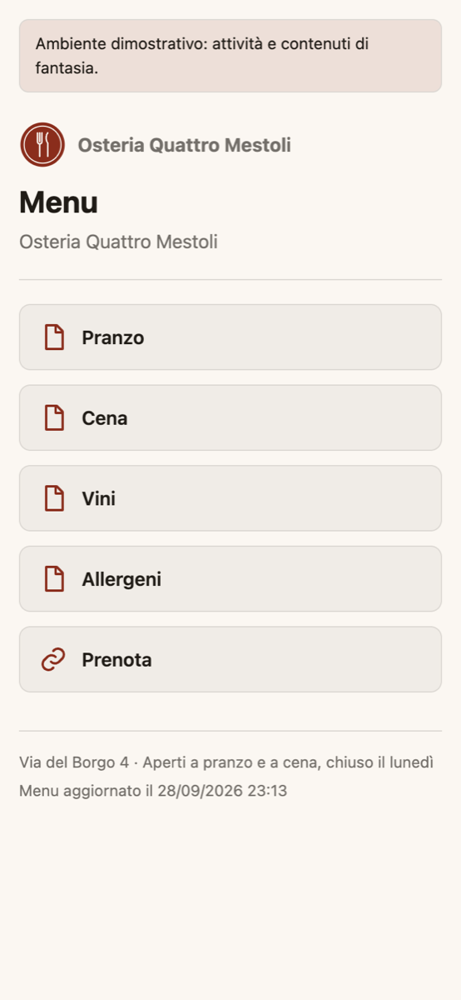
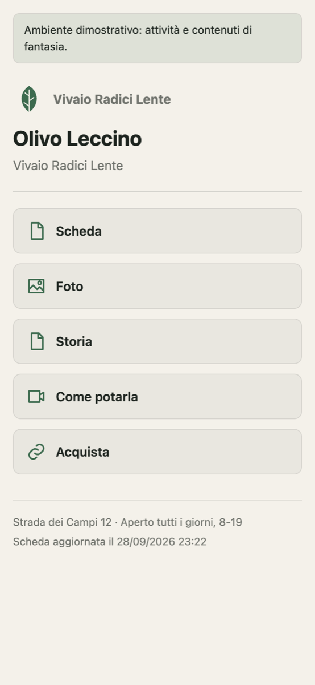
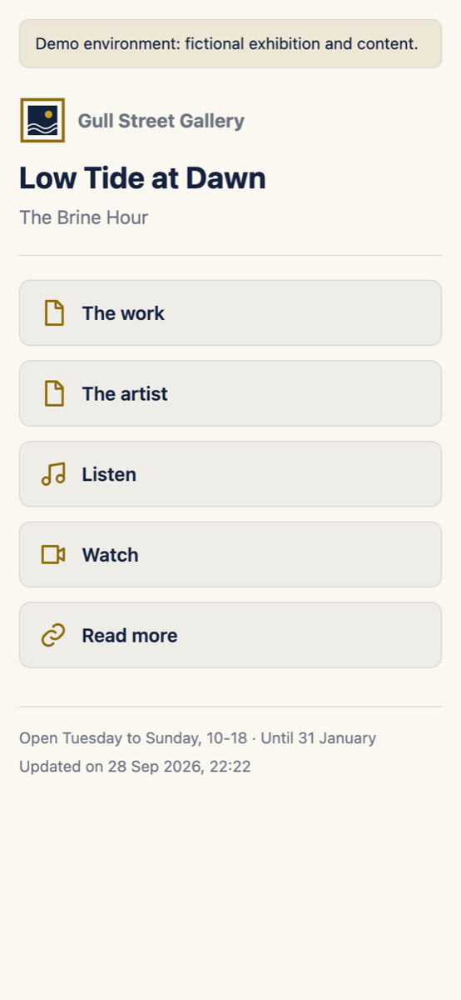

# swingtag

**A linktree for physical things.** Print once, own the link. The folder is the CMS.

Put a QR code on a menu, a plant or an artwork. Behind it, swingtag serves a small, fast page
with the documents, photos, audio, video and links that belong to that object. You update the
page by dropping files into a folder on Amazon S3, and the printed code never changes because
the address lives in your own AWS account, not with a vendor.

<p>
  
  
  
</p>

The three examples are fictional: a restaurant, a plant nursery and an exhibition. The
screenshots are captures of real deployments of `examples/`.

## Try it

You need Terraform 1.9 or later, Python 3.12 and credentials for an AWS account you can
create resources in.

```sh
make venv                                             # once: local Python environment
AWS_PROFILE=my-profile make demo EXAMPLE=restaurant   # or nursery, exhibition
```

`make demo` runs the tests, builds the publisher package and applies `examples/<name>/`. After
about four minutes (most of it is CloudFront) it prints the address and QR code of every page;
the pages are online within a minute after the apply ends. The deployment goes to `eu-west-1`
unless you set `region` in `examples/<name>/terraform.tfvars`, and the Terraform state stays in
the example folder.

```sh
AWS_PROFILE=my-profile make verify EXAMPLE=restaurant    # live checks of the deployed site
AWS_PROFILE=my-profile make destroy EXAMPLE=restaurant   # removes everything, see Teardown
```

## How it works: the folder is the CMS

Files live in the `source/` zone of the bucket; the publisher turns each item folder into a
page in the `public/` zone, which CloudFront serves. Nothing else is needed: no database, no
admin interface, no JavaScript.

```
source/
  Vivaio Radici Lente/                     collection
    Olivo Leccino · tzkvn6jgrxi6/          item: one object, one QR code, one page
      10 Scheda/scheda.pdf                 entry: one button, ordered by its number
      20 Foto/foto.jpg
      40 Come potarla/potatura.mp4
      50 Acquista/acquista.url             a link to an external page
```

- The part after ` · ` is the item's permanent address (`https://<your-site>/tzkvn6jgrxi6`).
  A new folder gets one automatically. Rename the readable part or move the folder to another
  collection as you like: keep the token and the printed code keeps working.
- **Never edit or delete the token.** It is the one change that cannot be undone: the folder
  gets a new address and the code already printed on the object stops answering.
- The number in front of an entry sets its position and is not shown.
- An entry with one file becomes one button named like the entry; an entry with several files
  becomes one button per file.
- Names starting with `.` or `_` are ignored at every level (handy for drafts: `_drafts/`), and
  files that do not fit the convention are skipped and logged, never shown to visitors.
- A change is online in under a minute (measured on the examples: 42 to 46 seconds).

Upload with any S3 client: the AWS console, a desktop client or `aws s3 cp`. To let the people
who manage the content write the `source/` zone and nothing else, list their IAM principals in
`uploader_principal_arns`.

## Theme

One file per deployment, `theme/theme.yaml`, plus `theme/assets/` for the logo:

```yaml
locale: it                     # en | it: fixed wording and date format
timezone: Europe/Rome          # for the "updated" date
logo: logo.svg                 # a file in theme/assets/
header: "Osteria Quattro Mestoli"
footer: "Via del Borgo 4 · Aperti a pranzo e a cena"
notice: "Demo environment"     # optional highlighted band at the top
show_updated: true             # false hides the "updated" date line
colors:                        # required, #rrggbb
  primary: "#8a2d1c"
  background: "#fbf7f2"
  text: "#1f1b16"
colors_dark:                   # optional: enables the dark mode
  primary: "#e0a15a"
  background: "#171412"
  text: "#f2ede6"
strings:                       # optional: replace the fixed wording
  updated: "Menu aggiornato il"
```

Every key is optional except `colors`. A wrong key or value stops `terraform plan` with a
message that names it; poor contrast only gives a warning. A theme change reaches every page
with the next apply.

## Formats

| Kind | Extensions |
|---|---|
| Document | `.pdf` |
| Image | `.jpg`, `.jpeg`, `.png`, `.webp` |
| Audio | `.mp3`, `.m4a` |
| Video | `.mp4` |
| Link | `.url` (Windows shortcut), `.webloc` (macOS link); only `http` and `https` |

Every resource opens directly in the phone's own viewer or player. Files up to 5 GiB.

## Your own domain

By default pages answer on a `*.cloudfront.net` address, which is fine for trying it out.
**For labels you are going to print, use a domain you control**: a printed code lasts as long
as the object. With a public Route 53 hosted zone in the same account, create
`examples/<name>/terraform.tfvars` (git ignores it):

```hcl
domain_name      = "qr.example.com"
hosted_zone_name = "example.com"
```

The next apply issues the certificate and creates the DNS records.

## Costs

An estimate from AWS list prices, not a measured bill: for a few dozen objects and modest
traffic, CloudFront, Lambda and SQS stay within the free tier, S3 storage costs a few cents a
month, and the dead-letter alarm costs up to $0.10 a month. A custom domain adds the Route 53
hosted zone ($0.50 a month) if you do not already have one.

## Teardown

```sh
AWS_PROFILE=my-profile make destroy EXAMPLE=restaurant
```

Removes every resource of the example, objects and versions included (about six minutes, most
of it CloudFront). The example buckets are created with `force_destroy`; the module's default
keeps a bucket that still holds files.

## When something is not published

Each failed publication is retried; after five failures the message lands in a dead-letter
queue and a CloudWatch alarm fires (`alarm_actions` can notify an SNS topic). The publisher's
log group, `/aws/lambda/<name>-<suffix>-publisher`, has one line per publication and one per
anomaly (`anomaly on <item>: <reason>: <file>`).

## Printable plates

```sh
AWS_PROFILE=my-profile make plates EXAMPLE=nursery    # build/plates-nursery.pdf
```

An A4 sheet with the QR code, name and collection of every item, ready to cut.

## Development

```sh
make venv && make test                       # unit tests
terraform -chdir=terraform test              # module tests with mocked AWS
node terraform/functions/test_rewrite.mjs    # CloudFront function
```

To use `terraform/` as a module from another root, build the package with
`scripts/build_lambda.sh` and pass its folder as `package_dir`.

## Contributing

Issues and pull requests are welcome: see [CONTRIBUTING.md](CONTRIBUTING.md).

## License

MIT. Example businesses, people and content are fictional.
