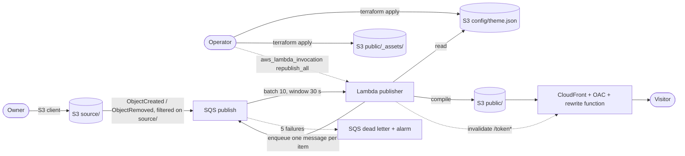

# placard: specification

**Status:** draft for review · **Version:** 0.2 · **Date:** 2026-09-25

A linktree for physical things. A folder structure on Amazon S3 becomes a set of
mobile pages, one per physical object, each reachable from a QR code printed on
the object. The folder is the CMS.

---

## 1. Problem statement

Physical objects need a short, always current list of links: a restaurant table
needs the menu, a plant in a nursery needs its care sheet, an artwork needs its
audio guide. Today the owner of those objects either prints paper that goes stale,
or adopts a hosted tool that owns the URL printed on every label, or builds a small
website that someone has to maintain. placard lets the owner keep files in folders
on S3, which they already know how to fill, and turns each folder into a fast,
static, themed mobile page with a stable URL and a QR code. Replacing a file updates
the page within a minute; the printed code never changes.

## 2. Goals and success criteria

| ID | Goal | Measured by |
|---|---|---|
| G-1 | A stranger understands the idea in under a minute | README with screenshots of the three examples, above the fold |
| G-2 | A stranger sees it working with one command | `make demo EXAMPLE=<name>` on an AWS account with credentials ends with the list of page URLs printed by Terraform, and every URL answers `200` |
| G-3 | Content owners never touch anything but folders | every user story of the Owner actor is satisfied by S3 object operations only |
| G-4 | A printed QR code keeps working for the life of the object | rename, move, replace and re-upload scenarios in section 9 keep the URL stable |
| G-5 | The page is usable on a phone with poor coverage | one request to reach the menu, no JavaScript, page under 15 KB |

## 3. Non-goals

Written down so that nobody builds them by accident.

- **No storage other than S3.** No local filesystem mode, no Google Drive, Dropbox or
  other sources, no storage abstraction layer. S3 is the base of the design.
- **No hosted or online demo.** The demo runs in the evaluator's own AWS account.
- **No web upload interface.** Owners upload with any S3 client (console, desktop
  client, CLI).
- **No per-collection or per-item theme.** One theme per deployment.
- **No analytics, visit counters, cookies or tracking** of any kind.
- **No publication history.** The system serves the current version only; bucket
  versioning is a safety net, not a history.
- **No notifications** (email, SNS) when an item is created.
- **No custom player pages.** Audio, video, images and PDFs open directly in the
  phone's native viewer.
- **No per-item metadata file** (`_meta.json` or similar). Everything comes from names.
- **No generation of example media inside the repository.** Example PDFs, images,
  audio and video are committed as static files; no scripts produce them.
- **No physical label production.** The system provides the QR code and a printable
  A4 sheet; composing real labels is the owner's business.
- **No natural-language query over documents.**

## 4. Assumptions (decisions already taken)

| ID | Decision | Why |
|---|---|---|
| A-1 | Language of code, docs and spec is English; pages are localised (`en`, `it`) | open source audience; the examples show both locales |
| A-2 | One deployment = one bucket, one CloudFront distribution, one theme | keeps the theme a single file; examples are separate deployments |
| A-3 | The demo is deployed with Terraform only; `make` wraps build and apply | "run Terraform and find the bucket already populated" |
| A-4 | Example content is uploaded by Terraform (`aws_s3_object` over `fileset`) with folder names that already carry a token | a folder without token would be renamed by the publisher and re-uploaded by Terraform at every apply (loop) |
| A-5 | Custom domain and certificate are created only when `domain_name` is set; otherwise the site answers on `*.cloudfront.net` | zero prerequisites for the demo; README warns that real labels need an owned domain |
| A-6 | The Lambda package is built by `scripts/build_lambda.sh` (copy source, `pip install qrcode==8.2` into `build/lambda`); Terraform zips that folder | same as the origin system; `qrcode` is pure Python so a macOS build runs on Lambda ARM |
| A-7 | Runtime: Python 3.12 on arm64 Lambda; only dependency `qrcode` 8.2; everything else is the standard library plus `boto3` from the runtime | minimal supply chain |
| A-8 | Tokens are derived, not random: HMAC-SHA256 of the names with a secret key; any valid-format token found in a folder name is accepted as is | concurrency safety without locks (section 10.6); pre-tokenised mocks work without the key |
| A-9 | Menu is flat: one tap, one resource. No nesting, no accordions | usability on the spot; proven in the origin system |
| A-10 | With a custom theme the page is light only; an optional `colors_dark` block enables dark mode. The built-in default theme has both | brand colours cannot be darkened automatically without breaking contrast |
| A-11 | Links open in the same tab with `rel="noopener noreferrer"` | one tap, one destination, like every other entry |
| A-12 | Default AWS region of the examples: `eu-west-1`; overridable | common default; the module itself takes the region from its provider |
| A-13 | The origin system's code is not copied into this repository; its behaviour is transcribed in this spec | intellectual property of the origin system stays where it is |
| A-14 | Fictional names for the examples, with a disclaimer in the README: "Osteria Quattro Mestoli" (restaurant), "Vivaio Radici Lente" (nursery), "Tides of Light" at "The Harbour Gallery" (exhibition) | no real business on the screenshots |

## 5. Glossary

| Term | Meaning |
|---|---|
| **Deployment** | One instance of the Terraform module: a bucket, a distribution, a publisher, a theme |
| **Source zone** | The `source/` prefix of the bucket. Owners write here. Never reachable from the internet |
| **Public zone** | The `public/` prefix. Only the publisher writes here; CloudFront serves it |
| **Config zone** | The `config/` prefix. Terraform writes the theme here; the publisher reads it; never served |
| **Collection** | First folder level under `source/`: a group of items (a restaurant, a nursery, an exhibition) |
| **Item** | Second level: one physical object with one QR code and one page. Folder name = `{label} · {token}` |
| **Label** | The human-readable part of an item folder name, freely renamable |
| **Token** | 12 characters from `abcdefghijkmnpqrstuvwxyz23456789` after the separator; the item's permanent public address |
| **Separator** | ` · ` (space, U+00B7 middle dot, space) between label and token |
| **Christening** | The publisher's act of appending a token to an item folder that has none |
| **Entry** | Third level: a folder whose name gives the button label and its order |
| **Resource** | A file inside an entry: a document, image, audio, video or link |
| **Link entry** | A resource that is a `.url` or `.webloc` file; it becomes a button to an external URL |
| **Button** | One line of the page menu: one tap opens one resource |
| **Order prefix** | Leading number on an entry or file name (`10 Lunch`) that sets the position and is stripped from the label |
| **Anomaly** | Something in the source zone that does not follow the convention; ignored and logged |
| **Theme** | `theme/theme.yaml` plus `theme/assets/`, one per deployment |
| **Plates sheet** | A printable A4 PDF with the QR code and names of every item of a deployment |
| **Publisher** | The Lambda function that compiles the source zone into the public zone |
| **Republish-all** | A full recompilation of every item and of the error page, triggered by a theme change |

## 6. Actors

| Actor | Who | Interacts through |
|---|---|---|
| **Owner** | The person who keeps the content: restaurateur, nursery keeper, curator. Not technical | an S3 client on the source zone |
| **Visitor** | Whoever scans the QR code on the object | a phone browser |
| **Operator** | Who deploys and configures placard in an AWS account | Terraform, `make`, `theme.yaml` |
| **Evaluator** | A stranger on GitHub deciding whether the project is worth anything | README, `make demo` |
| **Contributor** | A developer changing the code | repository, tests, spec |
| **Publisher** (system) | The Lambda function reacting to source changes | S3 events via SQS, direct invocation |

## 7. User stories

Priority: **M** must (v1), **S** should (v1 if cheap), **C** could (later).

### Evaluator

| ID | Story | Pri | Acceptance |
|---|---|---|---|
| US-1 | As an evaluator, I want to understand what placard does from the README in under a minute, so I can decide whether to try it | M | FR-50 |
| US-2 | As an evaluator, I want one command to deploy an example into my AWS account and see the pages, so I can judge it on real infrastructure | M | FR-40, FR-41, FR-43 |
| US-3 | As an evaluator, I want one command to remove everything the demo created, so trying it costs nothing afterwards | M | FR-42 |

### Owner

| ID | Story | Pri | Acceptance |
|---|---|---|---|
| US-4 | As an owner, I want to create a folder for a new object and drop files in it, so that a page appears without asking anyone | M | FR-1, FR-10, FR-20 |
| US-5 | As an owner, I want the button labels and their order to come from folder names, so that I control the menu without a form | M | FR-4, FR-5, FR-6 |
| US-6 | As an owner, I want to publish PDFs, images, audio, video and external links, so that each object gets the right medium | M | FR-7, FR-8 |
| US-7 | As an owner, I want to replace a file and have the page serve the new one within a minute, with the same QR code | M | FR-21, FR-23 |
| US-8 | As an owner, I want to rename or move an object's folder without breaking the printed code | M | FR-24 |
| US-9 | As an owner, I want mistakes in the folders (wrong format, wrong depth) to be ignored rather than shown to visitors | M | FR-9 |
| US-10 | As an owner, I want a printable sheet with all QR codes and names, so that I can label many objects at once | S | FR-45 |

### Visitor

| ID | Story | Pri | Acceptance |
|---|---|---|---|
| US-11 | As a visitor, I want the page to open fast on a weak connection and show large buttons, so I can use it with one hand | M | FR-30, FR-31 |
| US-12 | As a visitor, I want each button to open its resource directly in my phone's viewer or player | M | FR-32, FR-36 |
| US-13 | As a visitor, I want to see when the content was last updated, so I know whether to trust it | M | FR-33 |
| US-14 | As a visitor, I want a clear page when a code is wrong or retired, without learning anything about other objects | M | FR-35 |

### Operator

| ID | Story | Pri | Acceptance |
|---|---|---|---|
| US-15 | As an operator, I want to set colours, logo, header, footer and fixed wording in one file, so that pages carry my brand | M | FR-12, FR-13, FR-14 |
| US-16 | As an operator, I want a theme change to reach every published page with one apply | M | FR-15 |
| US-17 | As an operator, I want a bad theme file to stop the deployment with a clear message before anything changes in AWS | M | FR-12 |
| US-18 | As an operator, I want to attach my own domain optionally | M | FR-44 |
| US-19 | As an operator, I want to grant owners write access to the source zone only | M | FR-46 |
| US-20 | As an operator, I want failed publications to surface as an alarm, so they do not go unnoticed | M | FR-26 |
| US-21 | As an operator, I want a verification script that checks a live deployment end to end | S | FR-47 |

### Contributor

| ID | Story | Pri | Acceptance |
|---|---|---|---|
| US-22 | As a contributor, I want the naming rules, the catalogue and the rendering to be pure functions testable without AWS | M | section 10.2 |
| US-23 | As a contributor, I want a test to fail if an example folder lacks a valid token, so the Terraform loop can never come back | M | FR-43 |

## 8. Functional specification

### 8.1 Content convention

**FR-1 Path shape.** A resource is recognised only at exactly this depth:

```
source/{collection}/{label} · {token}/{entry}/{file}
```

Example: `source/Vivaio Radici Lente/Olivo Leccino · 3xk9m2p7qhv4/10 Care sheet/care.pdf`.

**FR-2 Token format.** 12 characters from the 32-symbol alphabet
`abcdefghijkmnpqrstuvwxyz23456789` (no `l`, `o`, `0`, `1`), exactly 60 bits.

**FR-3 Token recognition.** The token is the text after the **last** occurrence of the
separator, if it matches FR-2. Otherwise the whole name is the label and the item is
not christened: `Olive · north terrace` is an untokenised item labelled
`Olive · north terrace`.

**FR-4 Labels.** An entry with one resource produces one button labelled with the entry
name. An entry with several resources produces one button per resource, labelled with
the file name without extension, with the entry name shown as context under it.

**FR-5 Order prefix.** A leading number of 1 to 6 digits followed by a space, `.`, `-`
or `)` (regex `^(\d{1,6})\s*(?:[.)\-]\s*|\s+)(.+)$`) sets the order and is removed from
the label. A name made only of digits is a label, not a prefix. Numbered entries come
first by number; unnumbered entries follow in case-insensitive alphabetical order;
files inside one entry sort by the same rule.

**FR-6 Unicode.** Every folder and file name is normalised to NFC before any use
(labels, grouping, token derivation), so the same name typed on macOS and Windows
yields one button.

**FR-7 Accepted formats.**

| Kind | Extensions (case-insensitive) | Content-Type | Published as |
|---|---|---|---|
| document | `.pdf` | `application/pdf` | copied |
| image | `.jpg` `.jpeg` | `image/jpeg` | copied |
| image | `.png` | `image/png` | copied |
| image | `.webp` | `image/webp` | copied |
| audio | `.mp3` | `audio/mpeg` | copied |
| audio | `.m4a` | `audio/mp4` | copied |
| video | `.mp4` | `video/mp4` | copied |
| link | `.url` `.webloc` | none | read, not copied |

**FR-8 Link entries.** A `.url` file is read as INI (`[InternetShortcut]`, key `URL`,
UTF-8 with or without BOM). A `.webloc` file is read as a property list, XML or
binary, key `URL`. A link is valid only if its scheme is `http` or `https` and it has
a host. Files larger than 64 KiB are not read. An invalid or unreadable link is an
anomaly and produces no button.

**FR-9 Ignored content.**

| Case | Behaviour | Logged |
|---|---|---|
| Name starting with `.` or `_` at any level | ignored | no |
| `.DS_Store`, `Thumbs.db`, `desktop.ini`, `Icon\r` | ignored | no |
| Key ending with `/` (folder placeholder) | ignored | no |
| File directly in an item folder | ignored | yes |
| File deeper than the entry level | ignored | yes |
| Extension not in FR-7 | ignored | yes |
| Invalid link (FR-8) | ignored | yes |
| Entry with no valid resource | no button | no |
| Item with no valid resource | no page; an existing publication is removed | yes (info) |
| Key outside `source/{collection}/{item}/` depth | ignored | yes |

Anomalies are logged as `anomaly on {item prefix}: {reason}: {relative path}`.

### 8.2 Christening and tokens

**FR-10 Christening.** An item folder without a valid token that contains at least one
object is renamed by the publisher to `{label} · {token}`, where
`token = HMAC-SHA256(secret, NFC(collection) + "\x00" + NFC(label))`, first 12 bytes,
each reduced modulo 32 onto the alphabet. The label chosen by the owner is preserved.

**FR-11 Token stability.** A token already present in a folder name is never changed by
the system. The secret is generated once per deployment and never rotated.

### 8.3 Theme

**FR-12 Theme file and validation.** The operator provides `theme/theme.yaml` and an
optional `theme/assets/` folder next to the deployment's Terraform root. Schema:

| Key | Type | Required | Default | Rule |
|---|---|---|---|---|
| `locale` | string | no | `en` | `en` or `it` |
| `timezone` | string | no | `UTC` | IANA name; used for the "updated" date |
| `logo` | string | no | none | file name that must exist in `theme/assets/` |
| `header` | string | no | collection name | shown above the item name |
| `footer` | string | no | none | free text at the bottom |
| `notice` | string | no | none | highlighted band at the top (for example "Demo environment") |
| `colors.primary` | string | yes | | `#rrggbb` |
| `colors.background` | string | yes | | `#rrggbb` |
| `colors.text` | string | yes | | `#rrggbb` |
| `colors_dark.primary/background/text` | string | no | none | `#rrggbb`, all three or none |
| `strings.<key>` | string | no | built-in | only keys listed in FR-14 |

Any violation stops `terraform plan` with a message naming the key, before any AWS
change. Unknown top-level keys are also an error. The timezone is validated by the
publisher at load time; an invalid value falls back to `UTC` and is logged.

**FR-13 Assets.** Every file in `theme/assets/` is published at `/_assets/{file}` and
may be referenced by `logo`. Assets are served with their content type from FR-7 or,
for `.svg`, `image/svg+xml`; other extensions are rejected by validation.

**FR-14 Fixed wording.** Built-in strings in `en` and `it` for these keys, each
overridable through `strings`:

| Key | en | it |
|---|---|---|
| `updated` | Updated on | Aggiornato il |
| `empty` | Nothing is available here yet. | Qui non c'è ancora nulla. |
| `not_found_title` | Page not available | Pagina non disponibile |
| `not_found_body` | This code does not match any published page. Check that you scanned the whole code. | Questo codice non corrisponde a nessuna pagina pubblicata. Verifica di aver inquadrato il codice per intero. |
| `kind_document` | Document | Documento |
| `kind_image` | Image | Immagine |
| `kind_audio` | Audio | Audio |
| `kind_video` | Video | Video |
| `kind_link` | Link | Link |

The `kind_*` strings are the accessible names of the icons.

**FR-15 Theme propagation.** When the fingerprint of `theme.yaml` plus all assets
changes, the next apply triggers a republish-all: every item page and the error page
are recompiled with the new theme. Without a theme in the config zone the publisher
uses a built-in neutral theme (light and dark, locale `en`).

### 8.4 Publishing lifecycle

**FR-20 First publication.** Within one minute of the upload of the first valid
resource into a new item folder, the item is christened and its page, QR code and
resources are available at `/{token}`.

**FR-21 Replacement.** Overwriting a resource with the same name serves the new content
at the same URL within one minute.

**FR-22 Removal.** Deleting a resource removes its button and makes its public copy
unreachable within one minute.

**FR-23 Idempotence.** Republishing an unchanged item writes nothing and leaves the page
byte-identical.

**FR-24 Rename and move.** Renaming the label part, or moving the item folder to another
collection, while keeping the token, keeps the URL working and updates the header.

**FR-25 Empty and restore.** Emptying an item removes its publication; putting a
resource back restores it at the same token (derived tokens make a recreated folder
with the same collection and label converge on the same address).

**FR-26 Failures.** A publication that fails five times lands in a dead-letter queue and
raises a CloudWatch alarm. A failure on one item never causes other items of the same
batch to be retried.

**FR-27 Update date.** The date shown on the page is the latest modification time
among the item's resources (links included), in the theme's timezone, never the
publisher's clock.

### 8.5 The page

**FR-30 Weight and requests.** No JavaScript, one inline style block, no external fonts,
no remote images except the theme logo from the same origin. Under 15 KB with ten
buttons.

**FR-31 Layout.** Top to bottom: notice band (if set); header with logo (if set) and
header text; item label as `h1`; collection name as subtitle only when `header` is set
(otherwise the collection is already the header); the buttons; the footer text (if
set); the "updated" line. Touch targets at least 56 px high. `primary` colours the
icons, the focus ring and the notice band tint; every secondary tone (muted text,
lines, card background, notice background) is derived with `color-mix()` from `text`,
`background` and `primary` only, never from fixed white or black, so that dark
palettes stay coherent (T-14). Contrast is the operator's responsibility; `plan`
emits a warning (a `check` block, not an error) when `text` on `background` is below
4.5:1 or `primary` on `background` is below 3:1, and the same for `colors_dark` (T-09,
T-10).

**FR-32 Buttons.** Each button shows the kind icon (inline SVG with the `kind_*`
accessible name), the label and the optional context. File buttons link to the
absolute path `/{token}/{entry-slug}/{file-slug}.{ext}`; link buttons link to the
external URL with `rel="noopener noreferrer"`, same tab.

**FR-33 Update line.** `{strings.updated} {date}`, formatted `25/09/2026 14:30` for `it`
and `25 Sep 2026, 14:30` for `en`.

**FR-34 Escaping.** Every value coming from names, links or the theme is HTML-escaped.

**FR-35 Error page.** Any unknown path answers `404` with the themed error page, whose
text is `not_found_title` and `not_found_body`. It does not reveal whether a token ever
existed. Access-denied responses from the origin are also mapped to this page with
`404`.

**FR-36 Direct opening.** Documents, images, audio and video are served `inline` with
the content type of FR-7 and the original file name (ASCII-transliterated) in
`Content-Disposition`, so the phone opens them in its native viewer or player.

**FR-38 Public paths and slugs.** Entry and file slugs are computed by: applying the
transliteration table `ß→ss ẞ→SS æ→ae Æ→AE œ→oe Œ→OE ø→o Ø→O đ→d Đ→D ł→l Ł→L þ→th Þ→Th`,
then NFKD decomposition, dropping non-ASCII code points, case folding, replacing every
run of characters outside `[a-z0-9]` with `-`, trimming `-`. An empty result becomes
`entry` or `file`. NFKD alone drops letters such as `ß` (T-05), hence the table.

**FR-37 QR code.** Each item publishes `/{token}/qr.svg`, a vector QR code of the item
URL with error correction level Q.

### 8.6 Deployment and demo

**FR-40 One-command demo.** `make demo EXAMPLE=restaurant|nursery|exhibition` runs the
unit tests, builds the Lambda package and applies `examples/{name}` with Terraform.
Prerequisites: Terraform 1.9+ (cross-variable validation, T-21), Python 3.12, AWS
credentials in the environment.

**FR-41 Populated bucket.** The apply uploads the example's `content/` into
`source/` and its theme, and ends with every page already published (the
republish-all runs after the uploads).

**FR-42 Teardown.** `make destroy EXAMPLE={name}` removes every resource, including
all object versions in the example bucket (`force_destroy` is enabled in the
examples only).

**FR-43 Output.** The apply prints `pages`: a map from `"{collection} / {label}"` to
the page URL, computed from the example's folder names, and `qr_codes` with the
matching `qr.svg` URLs. Every example item folder carries a valid token; a unit test
fails otherwise.

**FR-44 Custom domain.** When `domain_name` and `hosted_zone_name` are set, the module
creates an ACM certificate in `us-east-1` with DNS validation and alias records;
otherwise it uses the CloudFront default certificate. The README warns that printed
labels must use an owned domain.

**FR-45 Plates sheet.** `make plates EXAMPLE={name}` writes `build/plates-{name}.pdf`:
an A4 grid (3 columns × 6 rows) with, for each christened item, its QR code, label and
collection, read from the source zone listing.

**FR-46 Uploader access.** `uploader_principal_arns` grants read, write and delete on
`source/*` and listing restricted to `source/`, nothing else. Empty by default.

**FR-47 Live verification.** `make verify EXAMPLE={name}` checks against the deployed
URL: security headers, HTTP to HTTPS redirect, short URL served, themed 404 for an
unknown token, no `<script>` in pages, content types per kind, `inline` disposition,
`206` with `Accept-Ranges: bytes` on a range request to an `.mp4`, and `media-src
'self'` in the CSP. Exit code is the number of failed checks.

### 8.7 Documentation

**FR-50 README.** In order: one-sentence pitch; screenshots of the three examples;
"try it" with the `make demo` command and prerequisites; the folder convention with
one example tree; the theme file; formats; custom domain warning; costs note;
teardown; license; a disclaimer that example businesses are fictional.

## 9. Edge cases

| ID | Situation | Expected behaviour |
|---|---|---|
| EC-1 | Ten files of one item uploaded at once | one publication (batch window aggregates, prefixes are deduplicated) |
| EC-2 | Two publisher runs find the same untokenised folder | both derive the same token; one item, no twin |
| EC-3 | Christening emits removal events for the old, now empty, prefix | no token is assigned to an empty folder (content check precedes christening) |
| EC-4 | Folder renamed keeping the token: for a moment two prefixes share it | the event of the empty prefix finds the owner of the token and republishes from there; the publication is not removed |
| EC-5 | Item moved to another collection keeping the token | same as EC-4; the owner search looks at the event's collection first, then all others |
| EC-6 | Owner edits or deletes the token part of the folder name | the item is christened again on a new token (derived from the label); the old address stops answering. Documented in the README as the one unrecoverable action |
| EC-7 | Two folders carry the same valid token (copy-paste of a folder) | the first in lexical key order owns the token; the other is logged as anomaly `duplicate token` and not published |
| EC-8 | Same name in NFC and NFD | one button (FR-6) |
| EC-9 | Two entries whose slugs collide (`Care/1`, `Care 1`) | second slug gets a numeric suffix (`care-1`, `care-1-2`); uniqueness is per level |
| EC-10 | Name that transliterates to nothing (`★★★`) | slug `entry` (entries) or `file` (files), then the collision rule |
| EC-11 | File name with only an extension (`.pdf`) | ignored silently (leading dot) |
| EC-12 | `.url` pointing to `javascript:`, `data:`, `file:` or a relative path | anomaly, no button |
| EC-13 | `.webloc` in binary plist format | parsed like XML |
| EC-14 | `.url` larger than 64 KiB | anomaly, not read |
| EC-15 | Resource larger than 5 GiB | anomaly `too large for single copy`, no button; other resources publish |
| EC-16 | Uppercase extension (`.PDF`, `.MP4`) | accepted; the public path uses the lowercase extension |
| EC-17 | Entry folder containing both valid and invalid files | valid ones become buttons; invalid ones are anomalies |
| EC-18 | Item whose only resources are invalid links | treated as empty (FR-25) |
| EC-19 | Theme changed while owners upload | republish-all and event-driven runs interleave safely (idempotent writes, conservative pruning) |
| EC-20 | `theme.json` missing or unreadable at runtime | built-in neutral theme, logged; pages still publish |
| EC-21 | Invalid timezone in the theme | `UTC`, logged |
| EC-22 | Logo removed from assets but still referenced | validation error at plan time (FR-12) |
| EC-23 | S3 test event on notification setup | ignored without error |
| EC-24 | Unparseable SQS body | ignored without failing the batch |
| EC-25 | Object key with spaces or non-ASCII characters in the S3 event | decoded with `unquote_plus` before use |
| EC-26 | CloudFront invalidation fails | logged; the publication counts as successful; cache expiry (60 s for pages) repairs it |
| EC-27 | Public zone written by the publisher | produces no events (notifications filtered on `source/`) |
| EC-28 | Two overlapping runs on one item | pruning spares objects written after the current run started |
| EC-29 | Evaluator runs `make demo` twice | second apply is a no-op except for the Lambda package hash if the code changed |
| EC-30 | Evaluator edits a mock in the console, then runs apply | Terraform restores the committed version; the publisher republishes it |
| EC-31 | Evaluator adds a new item folder in the console without token | christened by the publisher; Terraform does not know it and leaves it alone |
| EC-32 | `domain_name` set without `hosted_zone_name` | validation error at plan time |
| EC-33 | Visitor opens `/{token}` without trailing slash, with slash, or `/` | `/{token}/index.html`; `/` answers the 404 page |
| EC-34 | Visitor opens a resource URL of a removed item | 404 page |
| EC-35 | Item with more than 1,000 objects | listing is paginated; supported but outside the convention's intent |

## 10. Technical specification

### 10.1 Architecture



Bucket layout:

```
source/{collection}/{label} · {token}/{entry}/{file}   owners write, publisher reads
config/theme.json                                        Terraform writes, publisher reads
public/404.html                                          error page
public/_assets/{file}                                    theme assets (Terraform)
public/{token}/index.html                                item page
public/{token}/qr.svg                                    QR code
public/{token}/{entry-slug}/{file-slug}.{ext}            copied resources
```

`_assets` cannot collide with a token: `_` is not in the token alphabet.

### 10.2 Repository structure

```
placard/
  src/placard/
    __init__.py
    convention.py     names: separator, tokens, order prefix, NFC, ignore rules, slugs
    formats.py        FORMATS table, lookup(filename), parse_link(filename, body)
    theme.py          Theme dataclass, defaults, from_json(), contrast helper
    i18n.py           STRINGS[locale][key], format_date(dt, locale, tz)
    catalog.py        SourceObject, Button, Item, item_prefix(), build_item(), published_keys()
    render.py         render_page(item, theme, updated_at), render_not_found(theme)
    qr.py             qr_svg(url)
    settings.py       Settings.from_env()
    publish.py        Publisher: publish(prefix), republish_all(), publish_error_page()
    handler.py        lambda_handler(event, context)
  terraform/          reusable module
    versions.tf variables.tf outputs.tf
    s3.tf sqs.tf lambda.tf cloudfront.tf dns.tf theme.tf
    functions/rewrite.js
  examples/
    restaurant/ nursery/ exhibition/
      main.tf         provider, module call, content upload, outputs
      theme/theme.yaml
      theme/assets/logo.svg
      content/{collection}/{label} · {token}/{entry}/{file}
  scripts/
    build_lambda.sh   package into build/lambda
    plates.py         plates sheet (FR-45)
    pdfmin.py         minimal PDF writer used by plates.py
    verify.sh         live verification (FR-47)
  tests/
  spec/  plans/
  docs/screenshots/
  Makefile  README.md  LICENSE  CLAUDE.md  pyproject.toml
```

`convention`, `formats`, `theme`, `i18n`, `catalog`, `render` and `qr` import nothing
from AWS. `publish` and `handler` are the only modules that use `boto3`.

### 10.3 Module interfaces

```python
# convention.py
SEPARATOR = " · "
TOKEN_ALPHABET = "abcdefghijkmnpqrstuvwxyz23456789"
TOKEN_LENGTH = 12
def normalize(value: str) -> str                         # NFC
def is_token(value: str) -> bool
def token_for(collection: str, label: str, secret: str) -> str
def split_item_name(folder: str) -> tuple[str, str | None]   # (label, token)
def with_token(label: str, token: str) -> str
def parse_order(name: str) -> tuple[int | None, str]
def sort_key(order: int | None, label: str) -> tuple[int, int, str]
def is_ignored(name: str) -> bool
def slug(value: str, fallback: str) -> str
def unique_slug(value: str, taken: set[str], fallback: str) -> str

# formats.py
@dataclass(frozen=True)
class Format:
    kind: Literal["document", "image", "audio", "video", "link"]
    content_type: str | None      # None for links
    extension: str                # lowercase, with dot
MAX_LINK_BYTES = 65536
def lookup(filename: str) -> Format | None
def parse_link(filename: str, body: bytes) -> str | None   # validated http(s) URL or None

# theme.py
@dataclass(frozen=True)
class Colors: primary: str; background: str; text: str
@dataclass(frozen=True)
class Theme:
    locale: str = "en"; timezone: str = "UTC"; logo: str | None = None
    header: str | None = None; footer: str | None = None; notice: str | None = None
    colors: Colors = DEFAULT_COLORS; colors_dark: Colors | None = DEFAULT_DARK
    strings: Mapping[str, str] = field(default_factory=dict)
    def string(self, key: str) -> str      # override, else STRINGS[locale][key]
def from_json(body: bytes) -> Theme        # tolerant: bad values fall back and are logged
DEFAULT_THEME: Theme

# catalog.py
@dataclass(frozen=True)
class SourceObject: key: str; etag: str = ""; size: int = 0; modified: datetime | None = None
@dataclass(frozen=True)
class Button:
    order: int | None; label: str; context: str; kind: str
    href: str            # absolute public path for files, external URL for links
    public_key: str | None   # None for links
    source_key: str; filename: str; content_type: str | None
    etag: str; size: int; modified: datetime | None
@dataclass
class Item:
    collection: str; label: str; token: str
    buttons: list[Button]; anomalies: list[str]
    @property
    def empty(self) -> bool
    @property
    def updated_at(self) -> datetime | None     # max(button.modified)
def item_prefix(source_prefix: str, key: str) -> str | None
def split_prefix(source_prefix: str, prefix: str) -> tuple[str, str]  # (collection, folder)
def build_item(source_prefix: str, public_prefix: str, prefix: str,
               objects: list[SourceObject], link_bodies: Mapping[str, bytes]) -> Item
def published_keys(public_prefix: str, item: Item) -> set[str]

# render.py
def render_page(item: Item, theme: Theme) -> str
def render_not_found(theme: Theme) -> str

# publish.py
class Publisher:
    def __init__(self, settings: Settings, s3=None, cloudfront=None, sqs=None)
    def publish(self, prefix: str) -> Item
    def republish_all(self) -> int            # enqueues one message per item, returns count
    def publish_error_page(self) -> None
```

`build_item` stays pure: the publisher fetches the bodies of link files (only those
whose extension is a link and size ≤ `MAX_LINK_BYTES`) and passes them in
`link_bodies`, keyed by source key.

### 10.4 Configuration

Environment of the Lambda function:

| Variable | Meaning |
|---|---|
| `BUCKET` | bucket name |
| `SOURCE_PREFIX` | `source/` |
| `PUBLIC_PREFIX` | `public/` |
| `CONFIG_KEY` | `config/theme.json` |
| `PUBLIC_BASE_URL` | `https://{domain or distribution domain}` |
| `DISTRIBUTION_ID` | for invalidations; empty disables them |
| `QUEUE_URL` | publish queue, used by republish-all |
| `TOKEN_SECRET` | from `random_password`, `ignore_changes = all` |
| `LOG_LEVEL` | default `INFO` |

`theme.json` is the `yamldecode` of `theme.yaml`, re-encoded by Terraform with
`jsonencode` after validation; the publisher reads it once per invocation.

### 10.5 Event contract

The handler accepts two event shapes.

SQS batch (from S3 notifications, or from republish-all):

```json
{"Records": [{"messageId": "…", "body": "{\"Records\":[{\"s3\":{\"object\":{\"key\":\"source/Vivaio+Radici+Lente/Olivo+Leccino+%C2%B7+3xk9m2p7qhv4/10+Care+sheet/care.pdf\"}}}]}"}]}
```

Keys are URL-encoded and decoded with `unquote_plus`. `{"Event": "s3:TestEvent"}` and
unparseable bodies are skipped. Messages are grouped by item prefix; each prefix is
published once; the response lists only the message ids of failed prefixes:
`{"batchItemFailures": [{"itemIdentifier": "…"}]}`. Republish-all messages use the same
body shape with a placeholder file key under the item prefix.

Direct invocation:

```json
{"action": "republish_all"}
```

The handler publishes the error page, invalidates `/404.html` and `/_assets/*`, lists
every item prefix under `source/` (two delimiter listings) and sends one SQS message per
item in batches of 10. Returns `{"items": <count>}`. Enqueuing instead of publishing
inline keeps the invocation within the timeout for any number of items.

### 10.6 Publishing algorithm

For one item prefix:

1. List the source objects under the prefix.
2. **If empty:** if the folder has no token, stop (a christening moved it). If it has a
   token, search for another prefix owning the same token (the event's collection
   first, then every collection); if found, publish that prefix instead (rename in
   progress); otherwise remove the publication of that token and invalidate. Stop.
3. **If not empty and without token:** derive the token (FR-10), copy every object to
   the new prefix, delete the old keys, list again.
4. If the token is also carried by a lexically smaller prefix, log `duplicate token`
   and stop (EC-7).
5. Fetch link bodies; build the item.
6. If the item has no valid resource, remove the publication and invalidate. Stop.
7. For each file button, copy the source object to its public key unless the ETags
   match, with `MetadataDirective=REPLACE`, the content type from FR-7,
   `Content-Disposition: inline; filename="{ascii name}"` and
   `Cache-Control: public, max-age=300`. Objects over 5 GiB are anomalies (EC-15).
8. Render `index.html`; write it only if its MD5 differs from the existing ETag
   (`Cache-Control: public, max-age=60`, `text/html; charset=utf-8`).
9. Render `qr.svg`; same rule (`image/svg+xml`, `max-age=300`).
10. Prune public keys under `/{token}/` that are not in `published_keys`, sparing
    objects modified after the start of this run.
11. Invalidate `/{token}*`. Failures are logged, not raised.
12. Log anomalies.

Order matters: the content check (step 2) must precede christening (step 3), and the
owner search (step 2) must precede removal. Both come from failures observed in the
origin system.

### 10.7 Delivery

- CloudFront with Origin Access Control on the private bucket, `origin_path = /public`:
  the distribution cannot reach `source/` or `config/`.
- Managed cache policy `CachingOptimized`; `GET` and `HEAD`; compression; TLS 1.2 2021
  minimum; redirect HTTP to HTTPS; `PriceClass_100` by default (variable).
- Custom error responses: `403` and `404` both mapped to `/404.html` with status `404`.
- CloudFront Function on viewer-request, ES5 only:

| Request | Rewritten to |
|---|---|
| `/` | `/index.html` (absent, so 404 page) |
| `/{token}` or `/{token}/` | `/{token}/index.html` |
| last segment containing a dot | unchanged |

- Response headers policy:

| Header | Value |
|---|---|
| `Strict-Transport-Security` | `max-age=31536000; includeSubDomains` |
| `X-Content-Type-Options` | `nosniff` |
| `X-Frame-Options` | `DENY` |
| `Referrer-Policy` | `no-referrer` |
| `Content-Security-Policy` | `default-src 'none'; style-src 'unsafe-inline'; img-src 'self' data:; media-src 'self'; object-src 'self'; base-uri 'none'; form-action 'none'; frame-ancestors 'none'` |

`media-src 'self'` is required: without it browsers refuse to play audio and video
opened directly (spike S1).

### 10.8 Security

- Bucket: all public access blocked; SSE-S3 with bucket key; versioning on;
  noncurrent versions expire after 90 days (variable); deny non-TLS requests.
- Bucket policy: CloudFront reads `public/*` only, bound to the distribution ARN;
  uploaders per FR-46.
- Lambda role, no wildcards on resources: read/write/delete `source/*` and `public/*`,
  read `config/theme.json`, list the bucket restricted to `source/` and `public/`
  prefixes, invalidate the deployment's distribution, consume and send on the publish
  queue, write its log group.
- Link buttons accept only `http` and `https` (FR-8).
- Pages carry `<meta name=robots content=noindex,nofollow>`.
- No visitor data is collected or logged by the application.

### 10.9 Terraform module interface

Variables:

| Name | Type | Default | Notes |
|---|---|---|---|
| `name` | string | `placard` | prefix of every resource name |
| `theme_dir` | string | required | folder with `theme.yaml` and `assets/` |
| `domain_name` | string | `""` | FR-44 |
| `hosted_zone_name` | string | `""` | required when `domain_name` is set |
| `force_destroy` | bool | `false` | `true` in examples |
| `price_class` | string | `PriceClass_100` | |
| `lambda_timeout` | number | 120 | seconds |
| `lambda_memory` | number | 512 | MB |
| `noncurrent_version_expiration_days` | number | 90 | |
| `log_retention_days` | number | 30 | |
| `uploader_principal_arns` | list(string) | `[]` | FR-46 |
| `tags` | map(string) | `{}` | |

Providers: `aws` and `aws.us_east_1` (configuration alias, needed for the certificate;
examples pass it even when unused).

Outputs: `bucket`, `source_prefix`, `base_url`, `distribution_id`, `function_name`,
`dead_letter_queue_url`.

Theme handling (`theme.tf`): `yamldecode`, validation as resource preconditions
(spike S3), `aws_s3_object` for `config/theme.json` and each asset, a fingerprint of
`theme.yaml` plus assets, and `aws_lambda_invocation` with input
`{"action":"republish_all"}` whose `triggers` include that fingerprint and the Lambda
package hash.

Examples (`examples/{name}/main.tf`): provider in `eu-west-1` (variable `region`),
module call with `force_destroy = true`, `aws_s3_object` for each file of
`fileset("content", "**")` at `source/{path}` with `etag = filemd5(...)`, and
`depends_on` so uploads start after notifications exist; a second
`aws_lambda_invocation` for republish-all depends on all uploads. Outputs `pages` and
`qr_codes` per FR-43.

### 10.10 Make targets

| Target | Does |
|---|---|
| `test` | `python3 -m pytest` |
| `build` | `scripts/build_lambda.sh` |
| `demo EXAMPLE=x` | `test`, `build`, `terraform -chdir=examples/x init` and `apply -auto-approve` |
| `plan EXAMPLE=x` | `build` and `plan` |
| `destroy EXAMPLE=x` | `terraform destroy -auto-approve` |
| `plates EXAMPLE=x` | FR-45 |
| `verify EXAMPLE=x` | FR-47 using the `base_url` output |
| `fmt` | `terraform fmt -recursive` and `validate` |

`EXAMPLE` defaults to `restaurant`.

### 10.11 Examples content

| | restaurant | nursery | exhibition |
|---|---|---|---|
| Collection | Osteria Quattro Mestoli | Vivaio Radici Lente | Tides of Light |
| Items | 1: `Menu` | 6 plants (for example `Olivo Leccino`, `Glicine viola`, `Limone Femminello`, `Rosa canina`, `Lavanda angustifolia`, `Acero giapponese`) | 6 works |
| Entries per item | `10 Pranzo` (pdf), `20 Cena` (pdf), `30 Vini` (pdf), `40 Allergeni` (pdf), `50 Prenota` (url) | `10 Scheda` (pdf), `20 Foto` (jpg), `30 Storia` (pdf), `40 Come potarla` (mp4), `50 Acquista` (url) | `10 The work` (pdf), `20 The artist` (pdf), `30 Listen` (m4a), `40 Watch` (mp4), `50 Read more` (webloc) |
| Palette (primary / background / text) | `#8a2d1c` / `#fbf7f2` / `#1f1b16` | `#3d6b4f` / `#f4f1ea` / `#1d241f` | `#8c6d0f` / `#fbf8f1` / `#14213d` |
| Contrast text/bg, primary/bg (T-22) | 16.05, 7.96 | 14.06, 5.45 | 15.06, 4.59 |
| Logo | monogram with a fork | leaf | frame |
| locale | it | it | en |

Media files are placeholders produced once outside the repository and committed:
PDFs of one or two pages, JPEG under 100 KB, M4A under 100 KB, MP4 under 100 KB.
Links point to `https://example.com/...`. The owner of the repository will replace
them with better material later; file names stay the same.

### 10.12 Error handling summary

| Failure | Handling |
|---|---|
| Convention violation in source | anomaly log line, content skipped |
| S3 or copy error during publish | exception, the item's messages return as batch failures, SQS retries (5), then dead letter + alarm |
| Invalidation error | logged, not raised |
| Theme missing or invalid at runtime | built-in theme, logged |
| Invalid theme at deploy time | `terraform plan` fails with the key name |
| Republish-all send error | exception; `aws_lambda_invocation` fails the apply with the message |

### 10.13 Limits

SQS messages 256 KB (not a constraint); batch 10 with 30 s window;
`ListObjectsV2` pages of 1,000 (paginated); single `CopyObject` up to 5 GiB;
1,000 free invalidation paths per month (one per publication); Lambda 120 s, 512 MB,
reserved concurrency never set (see 11), SQS event source `maximum_concurrency = 2`;
queue visibility 6 × function timeout.

## 11. Known traps

Each one is a failure observed in the origin system or in a spike. A rewrite that
ignores them repeats them.

| Trap | Consequence if ignored |
|---|---|
| `reserved_concurrent_executions` with an SQS event source | pollers throttled, messages bounce, nothing publishes |
| Random tokens instead of derived | twin items with two addresses after concurrent christening |
| Christening before checking the folder has content | spurious tokens on empty folders at every residual event |
| Removing a publication without searching the token owner | renaming a folder kills its printed code |
| Page date from the clock | pages rewritten at every event, needless invalidations, a date that lies |
| `logging.basicConfig` in Lambda | no application logs; set the root logger level instead |
| S3 event keys not URL-decoded | every name with a space misread |
| Notifications not filtered on `source/` | publisher writes loop back into the queue |
| Content type inherited on copy | files downloaded instead of opened |
| Only 404 mapped to the error page | access denied leaks as a raw 403 |
| No NFC normalisation | visually identical twin buttons |
| CSP without `media-src` | audio and video refuse to play (spike S1) |
| Example folders without token | Terraform and christening fight: re-upload at every apply |
| Apostrophes inside expansions in bash 3.2 (macOS default) | scripts die on an unrelated line |
| `*.cloudfront.net` on printed labels | permanent dependency on a name you do not control |
| Rotating the token secret | new items with reused names change address |

## 12. Reference implementation and spikes

See `spec/spikes/README.md`: S1 media CSP, S2 link parsing, S3 theme validation in
Terraform, S4 range requests (deferred to live verification). The origin system is the
behavioural reference (assumption A-13).

Every technical assumption of this spec is tracked in `spec/ASSUMPTIONS.md` with the
experiment that confirms it. Implementation may rely only on CONFIRMED assumptions;
PENDING ones have an experiment task in the backlog that must close first.

## 13. Acceptance

The system is done when every assumption in `spec/ASSUMPTIONS.md` is CONFIRMED
(ORIGIN entries re-run on placard infrastructure), every test in `spec/TEST-PLAN.md` passes, `make verify`
returns 0 on each of the three examples, the README screenshots are taken from those
deployments, and a manual check on an iOS phone plays the example audio and video.

## 14. Open questions

| ID | Question | Recommendation |
|---|---|---|
| Q-1 | License | MIT |
| Q-2 | Final project name (`placard` is free on the owner's GitHub account; PyPI and wider search not done) | keep `placard`, check before going public |
| Q-3 | ~~Permission from the origin system's owner~~ | **Resolved 2026-09-25: not needed** (owner decision). The repository stays private until the owner decides to publish |
